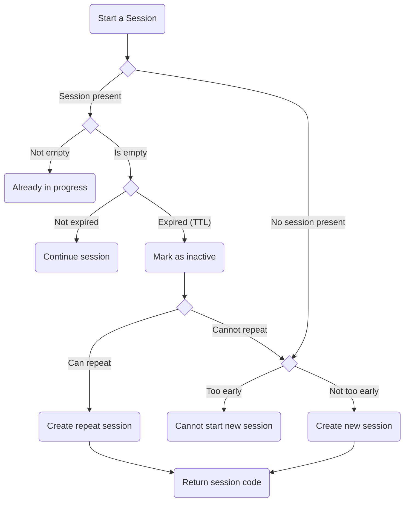

# Starting vs Continuing Logic

The below flowchart describes the logic that was implemented to determine whether to start a new session or continue an existing one given a user requests to start a new session.

## Assumptions
- That the user can repeat a session if they have not passed the specified Time To Live (TTL) for that study, provided that is allowed through the `isRepeatable` flag.
- That if the user is to continue an existing session, that they are **not** provided with the join code.

