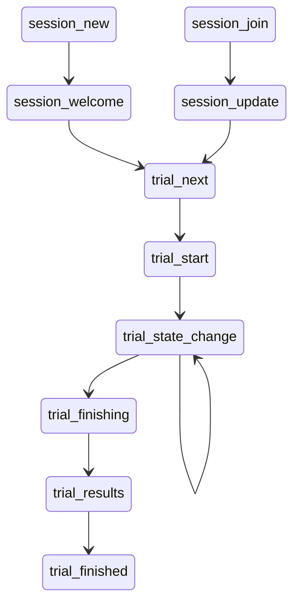

# System Overview

This page aims to provide a visual overview of how the system functions.

## At a Glance

## System States
### From the Client
- `session_new` - create a new session for a given participant
- `session_join` - join an existing session using a provided join code
- `trial_next` - begin the next trial in the study.
- `trial_state_change` - any change that is occurring in the system that the whole session should be aware of.
- `trial_finishing` - wrap up the trial, request results from the client
- `trial_results` - provide trial results to the server for storage.

### From the Server
- `session_welcome` - you have joined a session
- `session_update` - contains the current state of the session, including a list of all the devices that are present.
- `trial_start` - provides the trial data to the clients
- `trial_state_change` - after receiving from any client, pass along to all clients.
- `trial_finishing` - forward on from the client
- `trial_finished` - all results have been received. The trial is complete.

